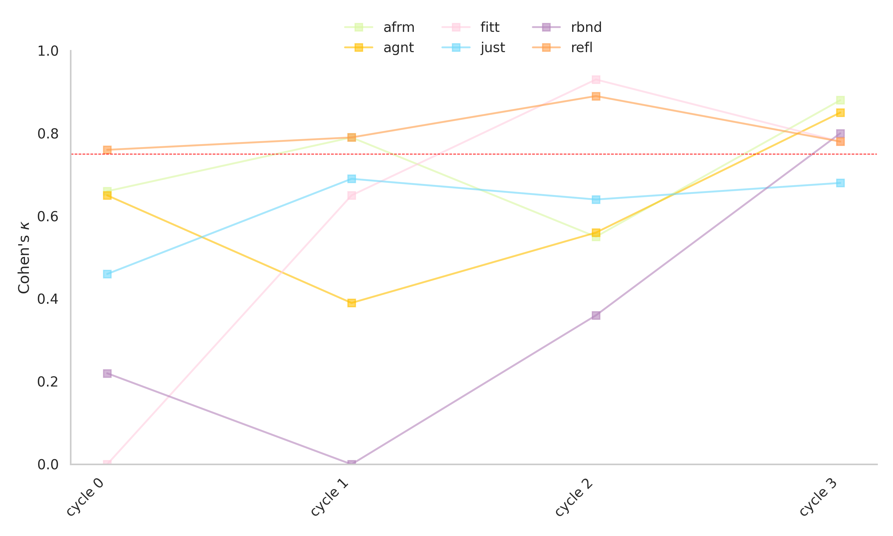

## 💢 Linguistic markers of subtle discrimination among mental health professionals
[Simone J. Skeen](https://simoneskeen.xyz/); Daniel A. Lau; [Patrick Button](https://www.patrickbutton.com/)

![A text that reads Good Morning <|PII|>, I am very sorry to hear you are feeling sad! (highlighted orange for "Reflect") We are living a difficult time right now and I would like to help you through this. Thanks for reaching out as I know that it is not easy to ask for help. (highlighted green for "Affirm") I do have appointments available. I offer a free [45] min phone consultation during which we can talk and see if we are a good fit to work together. (highlighted pink for "Fit") When would you like to set up the phone consult?](images/afrm_fitt_refl_ex.jpg)
_Toy datum containing illustrative examples of 'Reflect', 'Affirm', and 'Fit' utterances: inductively derived markers of empathic responding._

> ***Description:***[^1] Transgender and gender-diverse (TGD), African American, and Hispanic people endure disparities in psychiatric morbidity and discrimination in mental healthcare access. Initial clinical encounters, including appointment queries to private practice mental health professionals (MHPs), represent an under-examined context in which subtle discrimination may deter prospective clients. Previous experimental audit studies examine discrimination in healthcare access by quantifying _if_ the MHP responds to appointment queries. We consider _how_ the MHP responds, examining whether subtle discrimination could occur through response quality rather than response rates, exclusively. We used email and voicemail transcription data from a pilot audit study of MHP responses to appointment queries by simulated prospective clients, identical in presentation, but varied by race, ethnicity, and disclosed TGD status.[^2] Applying hybrid qualitative–AI language modeling techniques to these data, we conceptualized markers of MHP response quality capable of accurate classification by discriminative pretrained language models.

_Cohen's Kappa >0.75 achieved over k = 3 indepdendent expert training data annotation_.

### 📂 Pre-analaysis plan

A pre-analysis plan is filed on the Open Science Framework at [osf.io/wgu8q/](https://osf.io/wgu8q/).

[^1]: Mirrors the language at [osf.io/crvs5/](https://osf.io/crvs5/).

[^2]: Fumarco L, Harrell BJ, Button P, Schwegman DJ, Dils E. (2024). gender identity-, race-, and ethnicity-based discrimination in access to mental health care: Evidence from an audit correspondence field experiment. _Am J Health Econ._ 2024;10(2):182-214. https://doi.org/10.1086/728931
